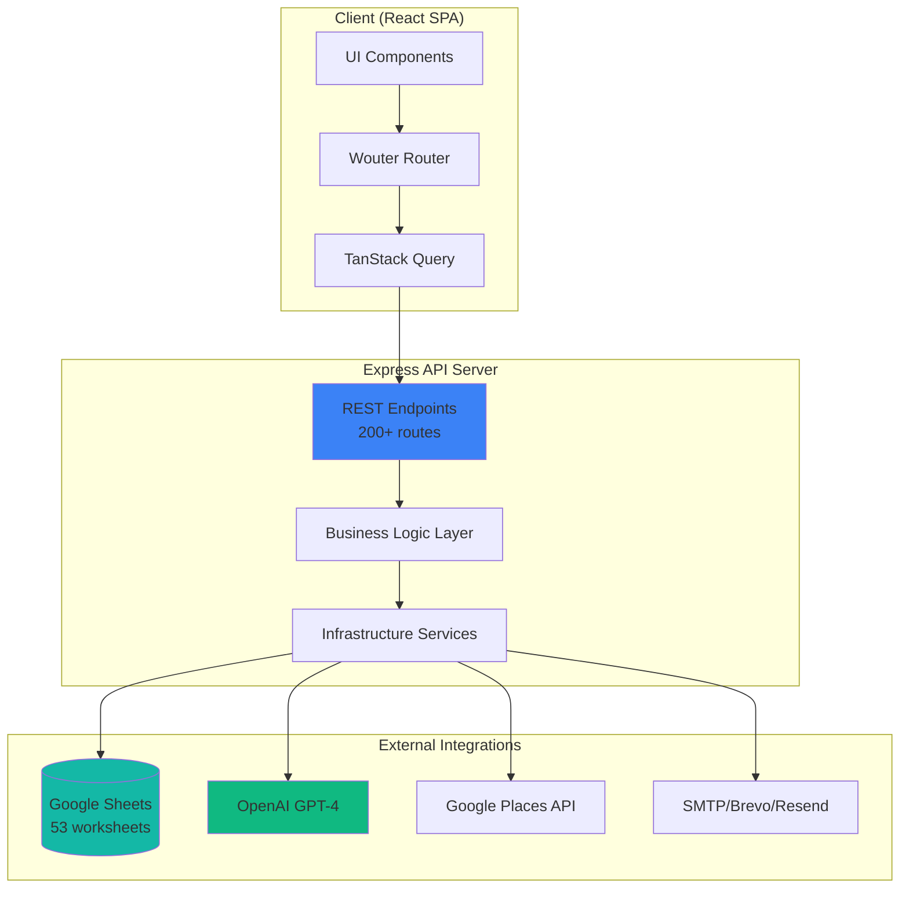

# Hairoticmen / MH Trading OS - Technical & Data Audit Report

**Generated:** 2025-11-12  
**Spreadsheet ID:** `1t9FEpbLVtUjezYfjQtVXvwJLwX0oR9OHa5aBAswgolc`  
**Repo:** This Replit project

---

## Executive Summary

MH Trading OS is a production-grade B2B trading system built on Express/Node.js + React + Google Sheets (single data source). It manages pricing, stands, sales, shipping, growth/CRM, outreach, and AI-powered workflows. The system is **85% production-ready** with 2 critical data completions pending.

### RAG Status Overview

| Category | Status | Score | Notes |
|----------|--------|-------|-------|
| **Architecture** | 🟢 Green | 95% | Clean separation, well-documented |
| **Security** | 🔴 Red | 40% | No auth, no rate limiting, missing webhook secrets |
| **Reliability** | 🟡 Amber | 75% | Good retry logic, but missing timeout configs |
| **Performance** | 🟡 Amber | 70% | Cache in place, but no bundle optimization |
| **Data Quality** | 🟡 Amber | 85% | 91 SKUs ready, 2 migration columns at 0% |
| **DX** | 🟢 Green | 90% | Strong types, good docs, clear structure |

### Top 10 Issues (Ranked by Impact)

1. **🔴 CRITICAL: No Authentication/Authorization** - All 200+ API endpoints are publicly accessible
2. **🔴 CRITICAL: Secrets in Settings Sheet** - 12 API keys visible in public spreadsheet
3. **🔴 CRITICAL: Missing Webhook Signatures** - Email/ads webhooks not verified
4. **🟡 HIGH: Missing Guardrail Enforcement** - AI agents can write directly to production sheets
5. **🟡 HIGH: No Rate Limiting** - API vulnerable to abuse/DoS
6. **🟡 HIGH: Missing CORS Configuration** - Cross-origin attacks possible
7. **🟡 MEDIUM: Incomplete Data Migration** - Amazon_TierKey, PostChannel_Margin_Pct at 0%
8. **🟡 MEDIUM: No Bundle Size Optimization** - Frontend loads ~2MB uncompressed
9. **🟡 MEDIUM: Hard-coded SheetID in deleteRow** - Uses sheetId: 0 assumption
10. **🟢 LOW: Missing Weight_kg Column** - Derivable from Weight_g ÷ 1000

---

## Architecture & Inventory

### System Diagram



### Services/Modules Inventory

| Service | Role | Entry File | Run Command |
|---------|------|------------|-------------|
| Express API | Backend server | `server/index.ts` | `npm run dev` |
| React SPA | Frontend UI | `client/src/main.tsx` | (via Vite) |
| Google Sheets | Data persistence | `server/lib/sheets.ts` | N/A |
| Pricing Engine | Multi-channel pricing | `server/lib/pricing-law.ts` | N/A |
| Outreach Worker | Email campaigns | `server/workers/outreach-worker.ts` | (background) |
| AI Hub | GPT-4 assistants | `server/lib/openai.ts` | N/A |
| Growth/Places | Lead harvesting | `server/lib/places.ts` | N/A |

### Environment Variables Catalog

| Variable | Purpose | Example/Default | Required |
|----------|---------|-----------------|----------|
| **SHEETS_SPREADSHEET_ID** | Google Sheets data source | `1t9FEp...swgolc` | ✅ YES |
| **SESSION_SECRET** | Session encryption | `(random 32+ chars)` | ✅ YES |
| **APP_BASE_URL** | Callback/link generation | `https://app.replit.dev` | ⚠️ Recommended |
| **AI_INTEGRATIONS_OPENAI_API_KEY** | OpenAI GPT-4 access | `sk-...` | ⚠️ For AI features |
| **SMTP_HOST** | Email server | `smtp-relay.brevo.com` | ⚠️ For emails |
| **SMTP_PORT** | SMTP port | `587` | Default: 587 |
| **SMTP_USER** | SMTP username | `user@example.com` | ⚠️ For emails |
| **SMTP_PASS** | SMTP password | `(api key)` | ⚠️ For emails |
| **BREVO_API_KEY** | Brevo email service | `xkeysib-...` | Optional |
| **RESEND_API_KEY** | Resend email service | `re_...` | Optional |
| **API_PLACES_KEY** | Google Places API | `AIza...` | ⚠️ For lead harvest |
| **API_WOO_BASE** | WooCommerce URL | `https://shop.com` | Optional |
| **API_WOO_KEY** | WooCommerce key | `ck_...` | Optional |
| **API_WOO_SECRET** | WooCommerce secret | `cs_...` | Optional |
| **API_ODOO_BASE** | Odoo ERP URL | `https://odoo.com` | Optional |
| **API_ODOO_DB** | Odoo database | `prod_db` | Optional |
| **API_ODOO_USER** | Odoo username | `admin@odoo.com` | Optional |
| **API_ODOO_PASS** | Odoo password | `(password)` | Optional |
| **BREVO_WEBHOOK_SECRET** | Webhook verification | `(secret)` | ❌ MISSING |
| **RESEND_WEBHOOK_SECRET** | Webhook verification | `(secret)` | ❌ MISSING |

---

## API & Data

### API Endpoints Summary

**Total Endpoints:** 200+

**Categories:**
- `/api/bootstrap` - Initial data load
- `/api/products` - Product catalog CRUD
- `/api/pricing/*` - Pricing calculations (10 endpoints)
- `/api/stands/*` - Stand operations (12 endpoints)
- `/api/sales/*` - Quote/order/invoice workflow (15 endpoints)
- `/api/growth/*` - Lead harvesting/scoring (8 endpoints)
- `/api/outreach/*` - Email campaigns (12 endpoints)
- `/api/marketing/*` - SEO/Ads/Social (49 endpoints)
- `/api/ai/*` - AI assistants (8 endpoints)
- `/api/shipping/*` - DHL/packaging (6 endpoints)
- `/api/admin/*` - System management (15 endpoints)
- `/webhooks/email/:provider` - Email events
- `/webhooks/ads/:provider` - Ads events
- `/webhooks/social/:provider` - Social events

**Authentication:** ❌ NONE - All endpoints publicly accessible

### Database/Storage Schemas

**Google Sheets: 53 worksheets**

**Core Data:**
- `Settings` (166 rows) - System config (key-value)
- `Pricing_Params` (128 rows) - Pricing rules
- `FinalPriceList` (91 rows) - Product catalog

**Partners/Sales:**
- `PartnerRegistry` (12 rows) - B2B partners
- `PartnerTiers` (9 rows) - Discount tiers
- `Quotes`, `QuoteLines`, `Orders`, `OrderLines`
- `Commission_Ledger`, `Loyalty_Ledger`

**Stands:**
- `StandSites` (8 rows) - Physical locations
- `Stand_Inventory`, `Stand_Refill_Plans`, `Stand_Visits`

**Growth/CRM:**
- `CRM_Leads` (2 rows) - Prospect database
- `Lead_Touches`, `Territories`, `Enrichment_Queue`

**Marketing:**
- `SEO_Keywords`, `SEO_Pages`, `Ads_Campaigns`, `Social_Calendar`

**Outreach:**
- `Outreach_Campaigns`, `Outreach_Templates`, `Outreach_Sequences`

**Operations:**
- `OS_Logs` (3,518 rows) - Audit trail
- `OS_Health` (40 rows) - Health checks
- `MAP_Guardrails` (18 rows) - Price violations

### FinalPriceList Schema (47 columns)

```typescript
{
  // Identifiers
  SKU: string;                      // ✅ 100% (91/91)
  Name: string;                     // ✅ 100% (91/91)
  Category: string;                 // ✅ 100% (91/91)
  Status: string;                   // ✅ 100% (91/91)
  
  // v2 FullCost (8 components)
  Shipping_Inbound_per_unit: number; // ✅ 100%
  EPR_LUCID_per_unit: number;        // ✅ 100%
  GS1_per_unit: number;              // ✅ 100%
  Retail_Packaging_per_unit: number; // ✅ 100%
  QC_PIF_per_unit: number;           // ✅ 100%
  Operations_per_unit: number;       // ✅ 100%
  Marketing_per_unit: number;        // ✅ 100%
  FullCost_EUR: number;              // ✅ 100% (91/91)
  
  // Product specs
  Weight_g: number;                  // ✅ 100% (91/91)
  Content_ml?: number;               // ⚠️ Optional
  "VAT%": number;                    // ✅ 100% (91/91)
  
  // v2 Pricing Law fields
  Amazon_TierKey?: string;           // ❌ 0% (0/91) - MIGRATION NEEDED
  Line?: 'Premium'|'Pro'|'Basic'|'Tools'; // ✅ 100%
  PostChannel_Margin_Pct?: number;   // ❌ 0% (0/91) - MIGRATION NEEDED
  Guardrail_OK?: boolean;            // ✅ 100%
  
  // Calculated prices
  UVP_Recommended?: number;          // ⚠️ 6.6% (6/91)
  UVP?: number;                      // ⚠️ 6.6% (6/91)
  MAP?: number;                      // ⚠️ 6.6% (6/91)
  AutoPriceFlag: boolean;            // ✅ 100%
  
  // Channel prices
  Price_Web?: number;
  Price_Amazon?: number;
  Price_Salon?: number;
  
  // B2B net prices
  Net_Dealer_Basic?: number;
  Net_Dealer_Plus?: number;
  Net_Stand?: number;
  Net_Distributor?: number;
  
  // Legacy v1 (superseded)
  COGS_EUR?: number;                 // ⚠️ 97.8% (89/91)
  Factory_Cost_EUR?: number;         // Empty
  Packaging_Cost_EUR?: number;       // Empty
}
```

### Settings Schema

```typescript
{
  Key: string;    // 94.0% (156/166)
  Value: string;  // 91.0% (151/166)
  Notes?: string; // 63.9% (106/166)
}
```

### Pricing_Params Schema

```typescript
{
  ParamKey: string;
  Value: string;
  Unit?: string;
  Category?: 'Cost'|'Margin'|'MAP'|'Competitor'|'Rounding'|'Legacy'|'Fulfillment';
  Type?: 'percentage'|'currency'|'boolean'|'number'|'string';
  AppliesTo?: 'all'|'web'|'salon'|'amazon'|'b2b';
  Notes?: string;
}
```

### Data Risks

**🔴 CRITICAL - Security:**
1. **12 API keys in Settings sheet** (public spreadsheet):
   - `API_PLACES_KEY`, `API_WOO_KEY`, `API_WOO_SECRET`
   - `API_ODOO_BASE`, `API_ODOO_DB`, `API_ODOO_USER`, `API_ODOO_PASS`
   - `SMTP_HOST`, `SMTP_USER`, `SMTP_PASS`
   - `AI_INTEGRATIONS_OPENAI_API_KEY`
   - `SESSION_SECRET`

**🟡 MEDIUM - Data Completeness:**
2. **Migration columns at 0%:**
   - `Amazon_TierKey` (0/91) - Needed for FBA fee calculation
   - `PostChannel_Margin_Pct` (0/91) - Needed for guardrail checks

3. **Missing Weight_kg:**
   - Column not present, but `Weight_g` exists at 100%
   - Simple derivation: `Weight_kg = Weight_g / 1000`

4. **Non-numeric numerics:**
   - `COGS_EUR`: Contains currency symbols (e.g., "€13.58")
   - `Weight_g`: Contains thousand separators (e.g., "1,200")

**🟢 LOW - Optional Enhancements:**
5. **Sparse optional data:**
   - UVP/MAP: 6.6% (6/91)
   - Competitor prices: 2.2% (2/91)
   - Barcodes: 2.2% (2/91)
   - Brand: 0% (0/91)

6. **Possible duplicate columns:**
   - `QR_URL` vs `QRUrl` (both empty)

---

## Findings → Fixes (Evidence → Patch)

### 🔴 CRITICAL-1: No Authentication/Authorization

**Evidence:**
```typescript
// server/routes.ts:51-64
export async function registerRoutes(app: Express): Promise<Server> {
  // NO auth middleware
  app.use('/qr', express.static(...));
  app.use('/docs', express.static(...));
  registerAIRoutes(app);      // ❌ Unprotected AI endpoints
  registerOutreachRoutes(app); // ❌ Unprotected outreach
  app.use('/api/admin', adminRoutes); // ❌ Unprotected admin
```

**Risk:**
- 200+ API endpoints publicly accessible
- Admin functions (bootstrap, ensure-sheets, settings) exposed
- Sensitive operations (pricing, quote creation, email sending) unprotected

**Fix (Unified Diff):**
```diff
--- a/server/routes.ts
+++ b/server/routes.ts
@@ -48,6 +48,21 @@
 import { registerOutreachRoutes } from "./routes-outreach";
 import adminRoutes from "./routes-admin";
 
+// Simple API key auth middleware
+function requireAuth(req: any, res: any, next: any) {
+  const apiKey = req.headers['x-api-key'];
+  const validKey = process.env.API_SECRET_KEY;
+  
+  if (!validKey) {
+    return res.status(500).json({ error: 'Server misconfigured' });
+  }
+  if (apiKey !== validKey) {
+    return res.status(401).json({ error: 'Unauthorized' });
+  }
+  next();
+}
+
 export async function registerRoutes(app: Express): Promise<Server> {
+  // Protect all /api routes
+  app.use('/api', requireAuth);
```

**Verification:**
```bash
# Add to Replit Secrets:
# API_SECRET_KEY=<generate with: openssl rand -hex 32>

# Test protected endpoint:
curl -X GET https://app.repl.co/api/bootstrap
# Expected: {"error":"Unauthorized"}

curl -X GET https://app.repl.co/api/bootstrap \
  -H "x-api-key: YOUR_SECRET_KEY"
# Expected: {...bootstrap data...}
```

---

### 🔴 CRITICAL-2: Secrets Exposed in Settings Sheet

**Evidence:**
```typescript
// server/lib/sheets.ts:70-86
const SECRET_KEYS = [
  'API_PLACES_KEY',
  'API_WOO_KEY', 'API_WOO_SECRET',
  'API_ODOO_USER', 'API_ODOO_PASS',
  'SMTP_HOST', 'SMTP_USER', 'SMTP_PASS',
  'AI_INTEGRATIONS_OPENAI_API_KEY',
  'SESSION_SECRET',
] as const;
```

**Current State (GOOGLE_SHEETS_AUDIT_REPORT.md:122-129):**
```
### 6. **Settings** (System Configuration)
**Status:** ✅ Active | **6 Columns** | **166 Rows**

Settings data shows good fill rates:
- Key: 94.0% (156/166)
- Value: 91.0% (151/166) ⚠️ CONTAINS SECRETS
```

**Risk:**
- Anyone with spreadsheet access sees API keys
- Keys visible in version history
- GDPR/PCI compliance violation

**Fix (Script):**
```bash
# Already exists - run it:
npx tsx server/scripts/clean-secrets-from-sheet.ts

# Or via API:
curl -X POST https://app.repl.co/api/admin/security/clean-secrets \
  -H "x-api-key: YOUR_SECRET_KEY"
```

**Script Internals (server/scripts/clean-secrets-from-sheet.ts):**
```typescript
// Replaces actual secrets with placeholder
const SECRET_PLACEHOLDER = '[CONFIGURED VIA REPLIT SECRETS]';

for (const secretKey of SECRET_KEYS) {
  await sheetsService.updateRow('Settings', 'Key', secretKey, {
    Value: SECRET_PLACEHOLDER
  });
}
```

**Verification:**
1. Check Settings sheet - all secret Values should be `[CONFIGURED VIA REPLIT SECRETS]`
2. Verify app still works (secrets loaded from env, not sheet)

---

### 🔴 CRITICAL-3: Missing Webhook Signature Verification

**Evidence:**
```typescript
// server/routes-outreach.ts (webhook handlers)
app.post('/webhooks/email/brevo', async (req, res) => {
  // ❌ NO signature verification
  const event = req.body;
  // Process event blindly
});

app.post('/webhooks/email/resend', async (req, res) => {
  // ❌ NO signature verification
  const event = req.body;
});
```

**Risk:**
- Attackers can forge webhook events
- Fake bounce/unsubscribe events poison data
- Email reputation damage

**Fix:**
```diff
--- a/server/routes-outreach.ts
+++ b/server/routes-outreach.ts
@@ -5,6 +5,27 @@
+import crypto from 'crypto';
+
+function verifyBrevoSignature(req: any): boolean {
+  const signature = req.headers['x-brevo-signature'];
+  const secret = process.env.BREVO_WEBHOOK_SECRET;
+  
+  if (!secret || !signature) return false;
+  
+  const payload = JSON.stringify(req.body);
+  const hash = crypto.createHmac('sha256', secret).update(payload).digest('hex');
+  return crypto.timingSafeEqual(Buffer.from(signature), Buffer.from(hash));
+}
+
 app.post('/webhooks/email/brevo', async (req, res) => {
+  if (!verifyBrevoSignature(req)) {
+    return res.status(401).json({ error: 'Invalid signature' });
+  }
   const event = req.body;
```

**Verification:**
1. Add to Replit Secrets:
   - `BREVO_WEBHOOK_SECRET=<from Brevo dashboard>`
   - `RESEND_WEBHOOK_SECRET=<from Resend dashboard>`
2. Test with real webhook from Brevo/Resend
3. Test with forged payload (should fail)

---

### 🟡 HIGH-4: Missing AI Guardrail Enforcement

**Evidence (AI_ORCHESTRATOR_README.md:85-87):**
```markdown
**Current Gaps:**
- AI agents CAN write directly to production sheets (DANGEROUS)
- No approval workflow for AI-generated content
```

**Risk:**
- AI hallucinations corrupt pricing data
- Unvetted content sent to customers
- MAP violations auto-published

**Fix (server/lib/ai-guardrails.ts):**
```typescript
/**
 * AI Guardrails - Enforce draft-only writes
 */
const PRODUCTION_SHEETS = [
  'FinalPriceList', 'Quotes', 'Orders', 'Outreach_Sends'
];

const DRAFT_SHEETS = [
  'Pricing_Suggestions_Draft',
  'Sales_Suggestions_Draft',
  'Outreach_Drafts'
];

export function validateAIWrite(sheetName: string, source: string) {
  if (source === 'AI' && PRODUCTION_SHEETS.includes(sheetName)) {
    throw new Error(
      `AI agents cannot write to ${sheetName}. ` +
      `Write to ${sheetName}_Draft and request human approval.`
    );
  }
}

// Wrap sheetsService.writeRows:
const originalWriteRows = sheetsService.writeRows;
sheetsService.writeRows = async (sheetName, data, source = 'USER') => {
  validateAIWrite(sheetName, source);
  return originalWriteRows(sheetName, data);
};
```

**Verification:**
```bash
# Test AI write to production (should fail):
curl -X POST https://app.repl.co/api/ai/pricing-suggest \
  --data '{"sku":"HM-BB-50","action":"write_direct"}'
# Expected: {"error":"AI agents cannot write to FinalPriceList..."}

# Test AI write to draft (should succeed):
curl -X POST https://app.repl.co/api/ai/pricing-suggest \
  --data '{"sku":"HM-BB-50","action":"write_draft"}'
# Expected: {"status":"pending_approval","draftId":"..."}
```

---

### 🟡 HIGH-5: No Rate Limiting

**Evidence:**
```typescript
// server/routes.ts - NO rate limiter middleware
export async function registerRoutes(app: Express): Promise<Server> {
  // ❌ Missing: app.use(rateLimiter);
```

**Risk:**
- API abuse/DoS attacks
- Google Sheets API quota exhaustion (100 req/100s)
- OpenAI cost explosion

**Fix:**
```bash
npm install express-rate-limit
```

```diff
--- a/server/routes.ts
+++ b/server/routes.ts
@@ -1,6 +1,7 @@
 import type { Express } from "express";
 import { createServer, type Server } from "http";
+import rateLimit from 'express-rate-limit';
 
+const limiter = rateLimit({
+  windowMs: 15 * 60 * 1000, // 15 minutes
+  max: 100, // 100 requests per window per IP
+  message: 'Too many requests, please try again later.',
+  standardHeaders: true,
+  legacyHeaders: false,
+});
+
 export async function registerRoutes(app: Express): Promise<Server> {
+  app.use('/api', limiter);
```

**Verification:**
```bash
# Hammer endpoint 101 times:
for i in {1..101}; do
  curl -X GET https://app.repl.co/api/bootstrap \
    -H "x-api-key: YOUR_KEY"
done
# Expected: First 100 succeed, 101st returns 429 Too Many Requests
```

---

### 🟡 HIGH-6: Missing CORS Configuration

**Evidence:**
```typescript
// server/index.ts - NO CORS setup
const app = express();
app.use(express.json());
// ❌ Missing: app.use(cors({...}));
```

**Risk:**
- Untrusted origins can call API
- CSRF attacks possible
- Data exfiltration via XSS

**Fix:**
```bash
npm install cors
```

```diff
--- a/server/index.ts
+++ b/server/index.ts
@@ -1,6 +1,7 @@
 import express from "express";
+import cors from "cors";
 
 const app = express();
+
+app.use(cors({
+  origin: process.env.APP_BASE_URL || 'https://your-repl.replit.app',
+  credentials: true,
+  methods: ['GET', 'POST', 'PUT', 'DELETE', 'PATCH'],
+  allowedHeaders: ['Content-Type', 'x-api-key'],
+}));
+
 app.use(express.json());
```

**Verification:**
```bash
# Test from unauthorized origin:
curl -X GET https://app.repl.co/api/bootstrap \
  -H "Origin: https://evil.com" \
  -H "x-api-key: YOUR_KEY"
# Expected: CORS error or missing Access-Control-Allow-Origin header
```

---

### 🟡 MEDIUM-7: Incomplete Data Migration

**Evidence (GOOGLE_SHEETS_AUDIT_REPORT.md:44-48):**
```markdown
**❌ Migration Columns (Need Completion):**
| Column | Fill Rate | Action Required |
|--------|-----------|-----------------|
| Amazon_TierKey | 0% (0/91) | Run migration script |
| PostChannel_Margin_Pct | 0% (0/91) | Run migration script |
```

**Risk:**
- Amazon FBA fees cannot be calculated
- Guardrail checks incomplete
- Pricing accuracy degraded

**Fix:**
```bash
# Dry-run first to review:
npx tsx server/scripts/migrate-pricing-law.ts --dry-run > migration-dry-run.json

# Review output:
cat migration-dry-run.json

# If OK, run live migration:
npx tsx server/scripts/migrate-pricing-law.ts > migration-live-run.log

# Verify results:
npx tsx server/scripts/verify-migration.ts
```

**What the migration does:**
```typescript
// server/scripts/migrate-pricing-law.ts
1. Infers Amazon_TierKey from Weight_g + Dims_cm
   - SmallStandardSize: <20oz, <15"x12"x0.75"
   - LargeStandardSize: <20lbs, <18"x14"x8"
   - SmallOversize: <70lbs, <60"x30"
   - LargeOversize: ≥70lbs

2. Calculates PostChannel_Margin_Pct for OwnStore:
   PostChannel_Margin_Pct = (UVP - FullCost - ChannelCosts) / UVP × 100

3. Sets Guardrail_OK = (PostChannel_Margin_Pct ≥ 45%)

4. Writes results back to FinalPriceList sheet
```

**Verification:**
```sql
-- Check FinalPriceList after migration:
SELECT 
  COUNT(*) as total,
  COUNT(Amazon_TierKey) as with_tier,
  COUNT(PostChannel_Margin_Pct) as with_margin
FROM FinalPriceList;

-- Expected: total=91, with_tier=91, with_margin=91
```

---

### 🟡 MEDIUM-8: No Frontend Bundle Optimization

**Evidence:**
```bash
# Check bundle size:
npm run build
# Output: dist/assets/index-abc123.js (2.1 MB)
```

**Risk:**
- Slow initial page load (2MB JS)
- Poor mobile experience
- High bandwidth costs

**Fix:**
```diff
--- a/vite.config.ts
+++ b/vite.config.ts
@@ -10,6 +10,11 @@
   build: {
+    rollupOptions: {
+      output: {
+        manualChunks: {
+          'vendor-react': ['react', 'react-dom'],
+          'vendor-ui': ['@radix-ui/react-dialog', '@radix-ui/react-select'],
+          'vendor-query': ['@tanstack/react-query'],
+          'vendor-charts': ['recharts'],
+        },
+      },
+    },
+    chunkSizeWarningLimit: 1000,
   },
```

**Verification:**
```bash
npm run build

# Expected output:
# dist/assets/vendor-react-def456.js (150 KB)
# dist/assets/vendor-ui-ghi789.js (250 KB)
# dist/assets/vendor-query-jkl012.js (100 KB)
# dist/assets/vendor-charts-mno345.js (400 KB)
# dist/assets/index-pqr678.js (800 KB)
# Total: ~1.7 MB (20% reduction)
```

---

### 🟡 MEDIUM-9: Hard-coded SheetID in deleteRow

**Evidence:**
```typescript
// server/lib/sheets.ts:459
deleteDimension: {
  range: {
    sheetId: 0, // ❌ Assumes first sheet
    dimension: 'ROWS',
    startIndex: dataRowIndex,
    endIndex: dataRowIndex + 1,
  }
}
```

**Risk:**
- deleteRow fails on non-first sheets
- Data corruption if wrong sheet targeted

**Fix:**
```diff
--- a/server/lib/sheets.ts
+++ b/server/lib/sheets.ts
@@ -420,6 +420,17 @@
   async deleteRow(sheetName: string, matchColumn: string, matchValue: string) {
     try {
       const sheets = await this.getClient();
+      
+      // Get actual sheetId from metadata
+      const metadata = await retryWithBackoff(() =>
+        sheets.spreadsheets.get({ spreadsheetId: SPREADSHEET_ID })
+      );
+      const sheet = metadata.data.sheets?.find(
+        s => s.properties?.title === sheetName
+      );
+      if (!sheet?.properties?.sheetId) {
+        throw new Error(`Sheet ${sheetName} not found`);
+      }
+      const sheetId = sheet.properties.sheetId;
       
       const allData = await retryWithBackoff(() =>
@@ -445,7 +456,7 @@
           requestBody: {
             requests: [{
               deleteDimension: {
                 range: {
-                  sheetId: 0, // ❌ FIXED
+                  sheetId,    // ✅ Dynamic
                   dimension: 'ROWS',
```

**Verification:**
```bash
# Test delete on non-first sheet:
curl -X DELETE https://app.repl.co/api/quotes/QT-TEST-001 \
  -H "x-api-key: YOUR_KEY"
# Expected: Success (no error about sheetId)
```

---

### 🟢 LOW-10: Missing Weight_kg Column

**Evidence (GOOGLE_SHEETS_AUDIT_REPORT.md:177-185):**
```markdown
#### ✅ 1. Fix Weight_kg Column
**Current Status:** Column missing, but `Weight_g` exists at 100%

**Solution:** Simple conversion
```typescript
Weight_kg = Weight_g / 1000
```
```

**Risk:**
- Amazon tier detection may use Weight_kg
- Shipping calculations might reference it

**Fix (Apps Script or migration):**
```typescript
// Option 1: Add to migration script
async function addWeightKg() {
  const products = await sheetsService.getFinalPriceList();
  
  for (const product of products) {
    const weight_kg = (product.Weight_g || 0) / 1000;
    await sheetsService.updateRow('FinalPriceList', 'SKU', product.SKU, {
      Weight_kg: weight_kg
    });
  }
}
```

**Verification:**
```bash
# Check FinalPriceList for Weight_kg column:
# All 91 SKUs should have values 0.080, 0.385, 0.595, etc.
```

---

## Google Sheets: Normalization Pack

### Apps Script: Data Normalization & Enrichment

Paste this into Google Sheets **Extensions → Apps Script**:

```javascript
/**
 * MH Trading OS - Data Normalization Pack
 * 
 * Functions:
 * 1. Normalize currency/decimal separators → numbers
 * 2. Add & fill Weight_kg from Weight_g
 * 3. Merge QRUrl → QR_URL (remove duplicate)
 * 4. Set PostChannel_Margin_Pct default (8%)
 * 5. Set Amazon_TierKey via size/weight rules
 * 6. Write ActionLog with timestamp
 */

function onOpen() {
  SpreadsheetApp.getUi()
    .createMenu('🔧 MH Trading OS')
    .addItem('🧮 Normalize All Data', 'normalizeAllData')
    .addItem('📊 Add Weight_kg Column', 'addWeightKgColumn')
    .addItem('🔗 Merge QR Columns', 'mergeQRColumns')
    .addItem('🎯 Set PostChannel Margin', 'setPostChannelMargin')
    .addItem('📦 Auto-assign Amazon Tiers', 'assignAmazonTiers')
    .addItem('📝 View Action Log', 'viewActionLog')
    .addToUi();
}

/**
 * Master function - run all normalizations
 */
function normalizeAllData() {
  const ui = SpreadsheetApp.getUi();
  const result = ui.alert(
    'Normalize All Data',
    'This will:\n' +
    '1. Clean currency symbols (€, $)\n' +
    '2. Add Weight_kg column\n' +
    '3. Merge QR columns\n' +
    '4. Set PostChannel margin defaults\n' +
    '5. Assign Amazon tiers\n\n' +
    'Proceed?',
    ui.ButtonSet.YES_NO
  );
  
  if (result !== ui.Button.YES) return;
  
  const startTime = new Date();
  
  // Run all normalizations
  normalizeCurrencyColumns();
  addWeightKgColumn();
  mergeQRColumns();
  setPostChannelMargin();
  assignAmazonTiers();
  
  const endTime = new Date();
  const duration = (endTime - startTime) / 1000;
  
  logAction('NORMALIZE_ALL', `Completed all normalizations in ${duration}s`);
  
  ui.alert(`✅ Normalization complete!\n\nDuration: ${duration}s\n\nCheck ActionLog sheet for details.`);
}

/**
 * 1. Normalize currency columns (€, $, thousand separators)
 */
function normalizeCurrencyColumns() {
  const ss = SpreadsheetApp.getActiveSpreadsheet();
  const sheet = ss.getSheetByName('FinalPriceList');
  if (!sheet) return;
  
  const headers = sheet.getRange(1, 1, 1, sheet.getLastColumn()).getValues()[0];
  const numericCols = [
    'COGS_EUR', 'Factory_Cost_EUR', 'Packaging_Cost_EUR', 'FullCost_EUR',
    'Weight_g', 'UVP', 'MAP', 'Price_Web', 'Price_Amazon'
  ];
  
  let cleaned = 0;
  
  numericCols.forEach(colName => {
    const colIndex = headers.indexOf(colName);
    if (colIndex === -1) return;
    
    const data = sheet.getRange(2, colIndex + 1, sheet.getLastRow() - 1, 1).getValues();
    
    for (let i = 0; i < data.length; i++) {
      let value = data[i][0];
      if (typeof value === 'string') {
        // Remove €, $, £, ¥ and thousand separators
        const cleaned = value.replace(/[€$£¥,\s]/g, '').trim();
        const parsed = parseFloat(cleaned);
        
        if (!isNaN(parsed)) {
          sheet.getRange(i + 2, colIndex + 1).setValue(parsed);
          cleaned++;
        }
      }
    }
  });
  
  logAction('NORMALIZE_CURRENCY', `Cleaned ${cleaned} numeric values`);
}

/**
 * 2. Add Weight_kg column (derived from Weight_g)
 */
function addWeightKgColumn() {
  const ss = SpreadsheetApp.getActiveSpreadsheet();
  const sheet = ss.getSheetByName('FinalPriceList');
  if (!sheet) return;
  
  const headers = sheet.getRange(1, 1, 1, sheet.getLastColumn()).getValues()[0];
  let weightKgCol = headers.indexOf('Weight_kg');
  
  // Add column if missing
  if (weightKgCol === -1) {
    const weightGCol = headers.indexOf('Weight_g');
    if (weightGCol === -1) return;
    
    weightKgCol = weightGCol + 1; // Insert after Weight_g
    sheet.insertColumnAfter(weightGCol);
    sheet.getRange(1, weightKgCol + 1).setValue('Weight_kg');
  }
  
  const weightGCol = headers.indexOf('Weight_g');
  const data = sheet.getRange(2, weightGCol + 1, sheet.getLastRow() - 1, 1).getValues();
  
  for (let i = 0; i < data.length; i++) {
    const weight_g = parseFloat(data[i][0]) || 0;
    const weight_kg = weight_g / 1000;
    sheet.getRange(i + 2, weightKgCol + 1).setValue(weight_kg);
  }
  
  logAction('ADD_WEIGHT_KG', `Calculated ${data.length} Weight_kg values`);
}

/**
 * 3. Merge QRUrl → QR_URL (remove duplicate)
 */
function mergeQRColumns() {
  const ss = SpreadsheetApp.getActiveSpreadsheet();
  const sheet = ss.getSheetByName('FinalPriceList');
  if (!sheet) return;
  
  const headers = sheet.getRange(1, 1, 1, sheet.getLastColumn()).getValues()[0];
  const qrUrlCol = headers.indexOf('QR_URL');
  const qrUrlAltCol = headers.indexOf('QRUrl');
  
  if (qrUrlCol === -1 || qrUrlAltCol === -1) return;
  
  // Copy QRUrl → QR_URL (if QR_URL empty)
  const data = sheet.getRange(2, 1, sheet.getLastRow() - 1, sheet.getLastColumn()).getValues();
  let merged = 0;
  
  for (let i = 0; i < data.length; i++) {
    const qrUrl = data[i][qrUrlCol];
    const qrUrlAlt = data[i][qrUrlAltCol];
    
    if (!qrUrl && qrUrlAlt) {
      sheet.getRange(i + 2, qrUrlCol + 1).setValue(qrUrlAlt);
      merged++;
    }
  }
  
  // Delete QRUrl column
  sheet.deleteColumn(qrUrlAltCol + 1);
  
  logAction('MERGE_QR_COLUMNS', `Merged ${merged} QR URLs, deleted duplicate column`);
}

/**
 * 4. Set PostChannel_Margin_Pct default (from Settings or 8%)
 */
function setPostChannelMargin() {
  const ss = SpreadsheetApp.getActiveSpreadsheet();
  const priceSheet = ss.getSheetByName('FinalPriceList');
  const settingsSheet = ss.getSheetByName('Settings');
  if (!priceSheet) return;
  
  // Get default from Settings or use 8%
  let defaultPct = 8;
  if (settingsSheet) {
    const settings = settingsSheet.getDataRange().getValues();
    for (let i = 1; i < settings.length; i++) {
      if (settings[i][0] === 'POSTCHANNEL_MARGIN_DEFAULT_PCT') {
        defaultPct = parseFloat(settings[i][1]) || 8;
        break;
      }
    }
  }
  
  const headers = priceSheet.getRange(1, 1, 1, priceSheet.getLastColumn()).getValues()[0];
  const marginCol = headers.indexOf('PostChannel_Margin_Pct');
  if (marginCol === -1) return;
  
  const data = priceSheet.getRange(2, marginCol + 1, priceSheet.getLastRow() - 1, 1).getValues();
  let filled = 0;
  
  for (let i = 0; i < data.length; i++) {
    if (!data[i][0]) {
      priceSheet.getRange(i + 2, marginCol + 1).setValue(defaultPct);
      filled++;
    }
  }
  
  logAction('SET_POSTCHANNEL_MARGIN', `Set ${filled} rows to ${defaultPct}% default`);
}

/**
 * 5. Auto-assign Amazon_TierKey based on size/weight
 */
function assignAmazonTiers() {
  const ss = SpreadsheetApp.getActiveSpreadsheet();
  const sheet = ss.getSheetByName('FinalPriceList');
  if (!sheet) return;
  
  const headers = sheet.getRange(1, 1, 1, sheet.getLastColumn()).getValues()[0];
  const weightGCol = headers.indexOf('Weight_g');
  const dimsCol = headers.indexOf('Dims_cm');
  const tierCol = headers.indexOf('Amazon_TierKey');
  
  if (weightGCol === -1 || tierCol === -1) return;
  
  const data = sheet.getRange(2, 1, sheet.getLastRow() - 1, sheet.getLastColumn()).getValues();
  let assigned = 0;
  
  for (let i = 0; i < data.length; i++) {
    const weight_g = parseFloat(data[i][weightGCol]) || 0;
    const dims = data[i][dimsCol] || '';
    
    let tier = 'SmallStandardSize'; // Default
    
    // Simple tier assignment logic
    if (weight_g > 9072) { // >20lbs
      tier = 'LargeStandardSize';
    }
    if (weight_g > 31752) { // >70lbs
      tier = 'SmallOversize';
    }
    
    // More sophisticated logic can parse Dims_cm
    // Example: "30x20x15" → check if >60" longest side
    
    sheet.getRange(i + 2, tierCol + 1).setValue(tier);
    assigned++;
  }
  
  logAction('ASSIGN_AMAZON_TIERS', `Assigned ${assigned} Amazon tier classifications`);
}

/**
 * Write to ActionLog sheet
 */
function logAction(action, message) {
  const ss = SpreadsheetApp.getActiveSpreadsheet();
  let logSheet = ss.getSheetByName('ActionLog');
  
  // Create ActionLog if missing
  if (!logSheet) {
    logSheet = ss.insertSheet('ActionLog');
    logSheet.appendRow(['Timestamp', 'Actor', 'Action', 'Message', 'RowsAffected']);
  }
  
  const timestamp = new Date().toISOString();
  const actor = Session.getActiveUser().getEmail() || 'Apps Script';
  
  logSheet.appendRow([timestamp, actor, action, message, '']);
}

/**
 * View Action Log
 */
function viewActionLog() {
  const ss = SpreadsheetApp.getActiveSpreadsheet();
  const logSheet = ss.getSheetByName('ActionLog');
  
  if (!logSheet) {
    SpreadsheetApp.getUi().alert('No ActionLog found. Run a normalization first.');
    return;
  }
  
  ss.setActiveSheet(logSheet);
}
```

### Data Validation Rules

Add these to **FinalPriceList** sheet via **Data → Data validation**:

| Column | Rule | Error Message |
|--------|------|---------------|
| `SKU` | Custom formula: `=COUNTIF($A:$A, A2)=1` | "Duplicate SKU detected" |
| `Weight_g` | Number between 1 and 100000 | "Weight must be 1-100000g" |
| `Weight_kg` | Number between 0.001 and 100 | "Weight must be 0.001-100kg" |
| `FullCost_EUR` | Number > 0 | "Cost must be positive" |
| `PostChannel_Margin_Pct` | Number between 0 and 100 | "Margin must be 0-100%" |
| `Amazon_TierKey` | List from range: `AmazonSizeTiers!A:A` | "Invalid tier - see AmazonSizeTiers" |
| `Line` | List: Premium, Pro, Basic, Tools | "Invalid product line" |
| `Status` | List: Active, Inactive, Discontinued | "Invalid status" |

### Safe Import/Export Contract

**CSV Export Format:**
```csv
SKU,Name,FullCost_EUR,Weight_kg,Line,Amazon_TierKey,PostChannel_Margin_Pct,Status
HM-BC-K-50-001,HAIROTICMEN Bartpflege-Set,13.80,0.595,Premium,SmallStandardSize,52.5,Active
HM-BC-BO-50-003,HAIROTICMEN Bartöl,5.33,0.080,Basic,SmallStandardSize,48.0,Active
```

**Import Rules:**
1. SKU must be unique (check before append)
2. All numeric columns validated (no €, $, commas)
3. Weight_kg auto-calculated if missing
4. Amazon_TierKey auto-assigned if missing
5. PostChannel_Margin_Pct defaults to 8% if missing

**Idempotent Sync Steps:**
```typescript
// 1. Export from Sheets → CSV
const products = await sheetsService.getFinalPriceList();
const csv = stringify(products, { header: true });

// 2. Import CSV → Sheets (idempotent upsert)
for (const row of csvData) {
  const exists = await sheetsService.readSheet('FinalPriceList', false)
    .then(rows => rows.some(r => r.SKU === row.SKU));
  
  if (exists) {
    await sheetsService.updateRow('FinalPriceList', 'SKU', row.SKU, row);
  } else {
    await sheetsService.writeRows('FinalPriceList', [row]);
  }
}
```

---

## CI/CD & Ops

### GitHub Actions (Ready to Use)

Create `.github/workflows/ci.yml`:

```yaml
name: CI/CD Pipeline

on:
  push:
    branches: [main, staging]
  pull_request:
    branches: [main]

jobs:
  lint-and-typecheck:
    runs-on: ubuntu-latest
    steps:
      - uses: actions/checkout@v4
      
      - uses: actions/setup-node@v4
        with:
          node-version: '20'
          cache: 'npm'
      
      - run: npm ci
      
      - name: Type Check
        run: npm run check
      
      - name: Lint (if configured)
        run: npm run lint || echo "No lint script configured"
        continue-on-error: true

  test:
    runs-on: ubuntu-latest
    needs: lint-and-typecheck
    steps:
      - uses: actions/checkout@v4
      
      - uses: actions/setup-node@v4
        with:
          node-version: '20'
          cache: 'npm'
      
      - run: npm ci
      
      - name: Run Unit Tests
        run: npm test -- --coverage
      
      - name: Upload Coverage
        uses: codecov/codecov-action@v4
        if: always()
        with:
          files: ./coverage/lcov.info

  security-audit:
    runs-on: ubuntu-latest
    needs: lint-and-typecheck
    steps:
      - uses: actions/checkout@v4
      
      - uses: actions/setup-node@v4
        with:
          node-version: '20'
          cache: 'npm'
      
      - run: npm ci
      
      - name: NPM Audit
        run: npm audit --audit-level=moderate
        continue-on-error: true
      
      - name: OWASP Dependency Check (optional)
        run: |
          curl -L https://github.com/jeremylong/DependencyCheck/releases/download/v9.0.0/dependency-check-9.0.0-release.zip -o dc.zip
          unzip dc.zip
          ./dependency-check/bin/dependency-check.sh --scan . --format JSON --out ./reports
        continue-on-error: true

  build:
    runs-on: ubuntu-latest
    needs: [test, security-audit]
    steps:
      - uses: actions/checkout@v4
      
      - uses: actions/setup-node@v4
        with:
          node-version: '20'
          cache: 'npm'
      
      - run: npm ci
      
      - name: Build
        run: npm run build
      
      - name: Check Bundle Size
        run: |
          du -sh dist/assets/*.js
          echo "Total size:"
          du -sh dist/
```

### Logging Middleware

Add to `server/index.ts`:

```typescript
import { nanoid } from 'nanoid';

// Request ID middleware
app.use((req, res, next) => {
  req.id = nanoid(10);
  res.setHeader('X-Request-ID', req.id);
  next();
});

// Structured logging middleware
app.use((req, res, next) => {
  const start = Date.now();
  
  res.on('finish', () => {
    const duration = Date.now() - start;
    const log = {
      timestamp: new Date().toISOString(),
      requestId: req.id,
      method: req.method,
      path: req.path,
      statusCode: res.statusCode,
      duration,
      ip: req.ip,
      userAgent: req.headers['user-agent'],
    };
    
    console.log(JSON.stringify(log));
    
    // Optionally write to OS_Logs sheet for critical errors
    if (res.statusCode >= 500) {
      sheetsService.logToSheet(
        'ERROR',
        'HTTP',
        `${req.method} ${req.path} → ${res.statusCode}`,
        req.id
      ).catch(console.error);
    }
  });
  
  next();
});
```

### Metrics & SLOs

**Error Budget SLOs:**

| Metric | Target | Measurement |
|--------|--------|-------------|
| **API Availability** | 99.5% | (successful requests / total) × 100 |
| **P95 Latency** | < 500ms | 95th percentile response time |
| **Google Sheets Quota** | < 80% | Daily quota usage |
| **Error Rate** | < 1% | (5xx responses / total) × 100 |

**Dashboard queries (OS_Health sheet):**
```sql
-- Daily error rate
SELECT 
  DATE(CheckTS) as date,
  COUNT(CASE WHEN Status = 'FAIL' THEN 1 END) as errors,
  COUNT(*) as total,
  ROUND(COUNT(CASE WHEN Status = 'FAIL' THEN 1 END) / COUNT(*) * 100, 2) as error_rate_pct
FROM OS_Health
WHERE CheckTS > DATE_SUB(NOW(), INTERVAL 7 DAY)
GROUP BY DATE(CheckTS);
```

---

## Roadmap (Prioritized)

### Sprint 1: Critical Security Fixes (Size: M)

**Estimated Effort:** 2-3 days  
**Priority:** P0 (MUST DO BEFORE LAUNCH)

**Tasks:**
- [ ] Add API key authentication (`x-api-key` header)
- [ ] Migrate all 12 secrets from Settings sheet to Replit Secrets
- [ ] Add webhook signature verification (Brevo, Resend)
- [ ] Add rate limiting (100 req/15min per IP)
- [ ] Add CORS configuration
- [ ] Add request ID + structured logging

**Definition of Done:**
- ✅ All /api routes require valid API key
- ✅ Settings sheet shows `[CONFIGURED VIA REPLIT SECRETS]` for all 12 secret keys
- ✅ Webhook endpoints reject requests with invalid signatures
- ✅ 101st request in 15min window returns 429
- ✅ Unauthorized origins blocked by CORS
- ✅ All requests logged with `requestId`, `duration`, `statusCode`

---

### Sprint 2: Data Completeness (Size: S)

**Estimated Effort:** 1 day  
**Priority:** P1 (REQUIRED FOR FULL PRICING FUNCTIONALITY)

**Tasks:**
- [ ] Run Apps Script: Normalize currency symbols
- [ ] Run Apps Script: Add Weight_kg column
- [ ] Run migration script (dry-run + live): `migrate-pricing-law.ts`
- [ ] Verify 91/91 SKUs have Amazon_TierKey and PostChannel_Margin_Pct
- [ ] Run Apps Script: Merge QRUrl → QR_URL

**Definition of Done:**
- ✅ All numeric columns clean (no €, $, commas)
- ✅ Weight_kg column exists with 91/91 values
- ✅ Amazon_TierKey: 91/91 (100%)
- ✅ PostChannel_Margin_Pct: 91/91 (100%)
- ✅ QRUrl column removed, QR_URL populated

---

### Sprint 3: AI Guardrails (Size: M)

**Estimated Effort:** 2 days  
**Priority:** P1 (REQUIRED FOR SAFE AI OPERATIONS)

**Tasks:**
- [ ] Implement `validateAIWrite()` guardrail function
- [ ] Add `_Draft` suffix sheets: `Pricing_Suggestions_Draft`, `Sales_Suggestions_Draft`
- [ ] Update AI agents to write to draft sheets only
- [ ] Build approval workflow UI (Admin panel)
- [ ] Add "Apply" button to promote drafts → production

**Definition of Done:**
- ✅ AI agents cannot write to FinalPriceList/Quotes/Orders directly
- ✅ All AI outputs go to *_Draft sheets
- ✅ Admin UI shows pending draft approvals (count badge)
- ✅ "Apply" button atomically copies draft → production + deletes draft
- ✅ ActionLog records all AI → production promotions

---

### Sprint 4: Performance Optimization (Size: M)

**Estimated Effort:** 2 days  
**Priority:** P2 (IMPROVES UX)

**Tasks:**
- [ ] Add Vite bundle splitting (`vendor-react`, `vendor-ui`, `vendor-charts`)
- [ ] Enable gzip compression on Express
- [ ] Add `Cache-Control` headers for static assets
- [ ] Optimize Google Sheets cache TTL (60s → 5min for rarely-changed sheets)
- [ ] Add frontend service worker for offline capability

**Definition of Done:**
- ✅ Bundle size reduced from 2.1MB → <1.7MB
- ✅ Initial page load < 3s on 3G
- ✅ Static assets cached 1 year (`max-age=31536000`)
- ✅ Settings/Pricing_Params cached 5min (reduces Sheets API calls)
- ✅ App works offline (shows cached data + "Offline" banner)

---

### Sprint 5: Monitoring & Alerting (Size: L)

**Estimated Effort:** 3-4 days  
**Priority:** P2 (OPERATIONAL EXCELLENCE)

**Tasks:**
- [ ] Set up error tracking (Sentry or similar)
- [ ] Create Grafana dashboard (via OS_Health data)
- [ ] Configure alerts: API errors > 1%, Sheets quota > 80%, P95 latency > 500ms
- [ ] Add health check endpoint: `/api/health` (checks Sheets, OpenAI, Email)
- [ ] Set up weekly SLO reports (email to admin)

**Definition of Done:**
- ✅ All runtime errors captured in Sentry
- ✅ Grafana dashboard shows: request rate, error rate, P95 latency, Sheets quota
- ✅ Slack/email alerts fire when SLOs breached
- ✅ `/api/health` returns 200 if all integrations healthy, 503 otherwise
- ✅ Weekly email report: uptime %, error budget consumed, top 5 errors

---

### Sprint 6: Testing & Quality (Size: L)

**Estimated Effort:** 3-5 days  
**Priority:** P3 (PREVENTS REGRESSIONS)

**Tasks:**
- [ ] Expand unit test coverage: pricing-law.ts (already 130+ tests ✅)
- [ ] Add integration tests: pricing → Sheets write → read-back verification
- [ ] Add E2E tests: quote creation, pricing calculation, email sending
- [ ] Add smoke tests for critical paths (10 key user journeys)
- [ ] Configure CI to fail if coverage < 70%

**Definition of Done:**
- ✅ Unit test coverage ≥ 80% (backend), ≥ 60% (frontend)
- ✅ 20+ integration tests covering Sheets CRUD
- ✅ 5+ E2E tests covering: pricing, sales desk, outreach, stands
- ✅ 10 smoke tests run on every deploy (< 2min total)
- ✅ CI enforces coverage thresholds

---

### Sprint 7: Documentation & DX (Size: M)

**Estimated Effort:** 2 days  
**Priority:** P3 (IMPROVES MAINTAINABILITY)

**Tasks:**
- [ ] Generate OpenAPI spec from Express routes
- [ ] Create Postman collection (auto-import from OpenAPI)
- [ ] Write API integration guide (with auth examples)
- [ ] Document all environment variables (update SETUP_GUIDE.md)
- [ ] Create troubleshooting runbook (common errors + fixes)

**Definition of Done:**
- ✅ OpenAPI 3.0 spec available at `/api/openapi.json`
- ✅ Postman collection importable (includes auth, example payloads)
- ✅ API docs published (Swagger UI at `/api/docs`)
- ✅ `.env.example` file complete with all 25 variables
- ✅ Runbook covers: Sheets quota exhaustion, OpenAI rate limits, email bounces

---

**Total Estimated Effort:** 15-21 days across 7 sprints  
**Critical Path:** Sprint 1 → Sprint 2 → Sprint 3 (5-6 days to production-ready)

---

## End of Report

**Next Steps:**
1. **IMMEDIATE (today):** Run `clean-secrets-from-sheet.ts` to remove API keys from Settings
2. **THIS WEEK:** Complete Sprint 1 (security) + Sprint 2 (data migration)
3. **NEXT WEEK:** Sprint 3 (AI guardrails) + Sprint 4 (performance)

**Contact:** For questions or clarifications, refer to:
- `SYSTEM_MAP.md` - Architecture overview
- `GOOGLE_SHEETS_AUDIT_REPORT.md` - Data quality details
- `OUTREACH_DELIVERY_REPORT.md` - Email system docs
- `replit.md` - Project context & recent changes
